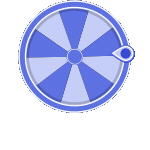
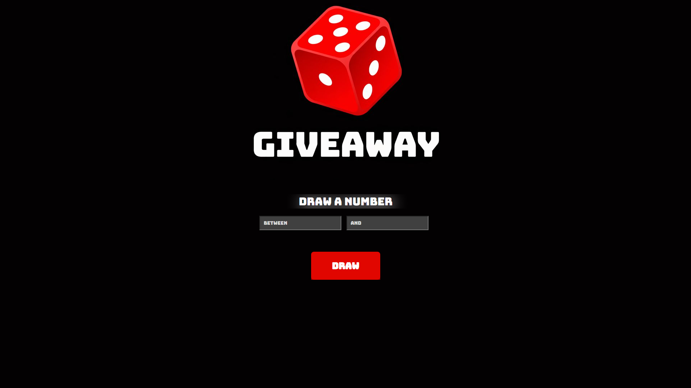

# 
🎲 Giveaway Number Drawer

A simple and interactive web app that generates a random number between a chosen range. Perfect for giveaways, raffles, and draws.

## 📸 Preview

## 🚀 Features

- Generate random numbers within a custom range  
- Simple and intuitive interface  
- Responsive layout  
- Instant draw result  

## 🛠 Technologies

- HTML5  
- CSS3  
- JavaScript  

## ▶ How to Use

1. Enter the minimum and maximum numbers  
2. Click the **Draw** button  
3. The random number will be displayed instantly  

## 🌐 Live Demo

👉 https://victor-f-padua.github.io/Drawer/

## 📚 What I Learned

This project helped me practice:

- DOM manipulation  
- Working with user input  
- Generating random numbers with JavaScript  
- Structuring a simple interactive app  

## 🔮 Future Improvements

- Add animation to the number draw  
- Add sound effects  
- Improve accessibility  

## 👨‍💻 Author

Developed by **Victor Ferreira**

